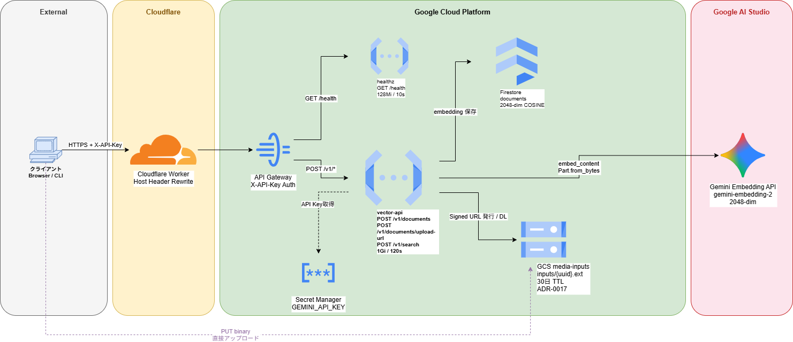
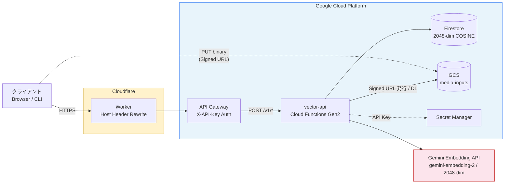

# gcp-serverless-vector-search

GCP 上で動く、サーバーレス構成のマルチモーダル（テキスト＋画像）ベクトル検索の個人ラボ。インフラは Terraform で管理する。

## これは何か

任意のテキストや画像をベクトル化（Embedding）して保存し、自然言語クエリ・画像クエリから類似データを検索する小さなシステム。最初のフェーズでは **API のみ提供**（画面なし）。エンドポイントは `vector-search.riri-inferno.com` 配下に展開する。

- テキスト → テキスト検索（自然言語で類似ドキュメントを引く）
- テキスト ↔ 画像、画像 ↔ 画像検索（同一ベクトル空間に射影することで実現予定）

### システムアーキテクチャ（高位構成図）



## 技術スタック

| レイヤー       | 採用                                                             | 選定理由                                                                                                                                             |
| -------------- | ---------------------------------------------------------------- | ---------------------------------------------------------------------------------------------------------------------------------------------------- |
| インフラ管理   | Terraform                                                        | 構成のコード化。`tfstate` は GCS にロック付きで保存                                                                                                  |
| DNS / TLS      | Cloudflare                                                       | `riri-inferno.com` 配下のサブドメイン管理、エッジで TLS 終端（プロキシON / SSL "Full"）                                                              |
| API 入口       | **API Gateway (GCP)**                                            | OpenAPI 仕様で認証・レート制限を肩代わり。実装側に認証コードを書かない                                                                               |
| 実行ランタイム | **Cloud Functions (2nd gen)**                                    | ゼロスケール。リクエストがない時間は完全に課金されない。画面不要なのでコンテナは過剰                                                                 |
| 埋め込みモデル | **`gemini-embedding-2`** (2048次元) via **Google AI Studio API** | テキスト・画像・動画・音声・PDF をすべて同じベクトル空間に射影できる。次元は柔軟（128〜3072）だが Firestore インデックス上限 2048 を採用（ADR 0015） |
| ベクトル DB    | Firestore (Native, `find_nearest`)                               | ネイティブにベクトル検索対応。起動固定費なし。インデックス作成は別途必須（後述）                                                                     |
| 静的アセット   | Cloud Storage                                                    | 画像バイナリ等の保存。Firestore には GCS URI とベクトルのみ格納                                                                                      |
| シークレット   | Secret Manager                                                   | Google AI Studio の API キー等を Cloud Functions に環境変数として安全にマウント                                                                      |

> **AI 基盤について**: 当面は Google AI Studio API（`gemini-embedding-2`）を使う。**Vertex AI 経由の利用は今後対応予定**。

## アーキテクチャ概要



DNS は Cloudflare で完結する。GCP 側に Cloud DNS ゾーンは持たない。詳細は [`docs/architecture.md`](docs/architecture.md) 参照。

## Firestore ベクトルインデックスについて

`find_nearest` は事前にベクトルインデックスを作成しないとクエリが極端に遅くなる（フルスキャン相当になる）。インデックス作成時に**次元数**・**距離関数 (COSINE / EUCLIDEAN / DOT_PRODUCT)** が固定されるため、後から変更したい場合は再作成が必要。実装時に都度レビューする。

## Terraform 構成 (予定)

[home-raspi-iac](https://github.com/Riri-Inferno/home-raspi-iac) のスタイル（プロバイダ別ディレクトリ + GitHub Actions plan/apply）を踏襲する。本リポジトリでは **GCP リソースのみ** を管理する：

```
terraform/
└── gcp/         # GCP リソース（API Gateway, Cloud Functions, Firestore, GCS, Secret Manager 等）
```

Cloudflare 側のリソース（`vector-search.riri-inferno.com` の DNS など）は、`riri-inferno.com` 全体を管理している [home-raspi-iac](https://github.com/Riri-Inferno/home-raspi-iac) の `terraform/cloudflare/` で一元管理する。複数リポジトリで CF を触らないこと。

## セキュリティ & コスト保護

DDoS や課金暴騰に対する多層防御方針は [docs/security.md](docs/security.md) を参照。Cloudflare 側の対策（WAF Custom Rules / Rate Limiting）は [home-raspi-iac](https://github.com/Riri-Inferno/home-raspi-iac) で管理する。

## ステータス

WIP — 初期構築フェーズ。最小構成（テキスト登録/検索のみ、画像は後回し）から組み上げる。
