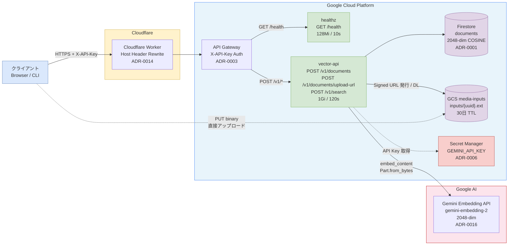
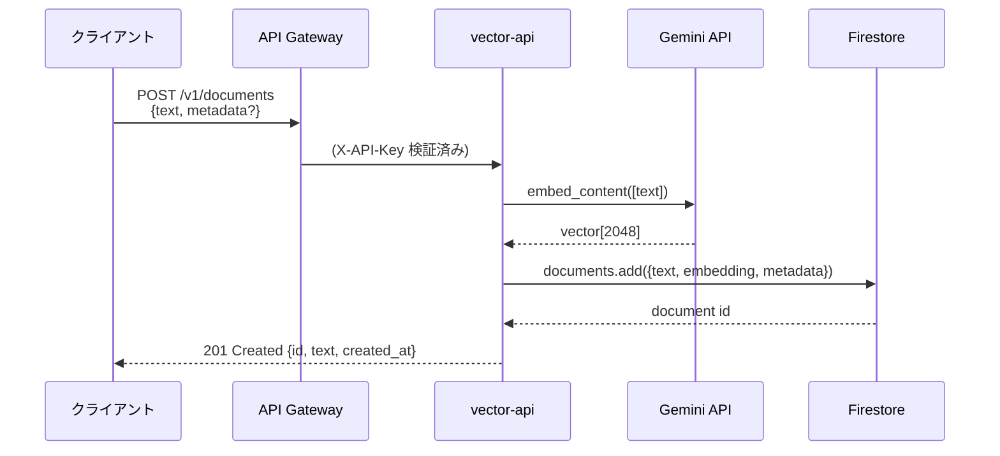
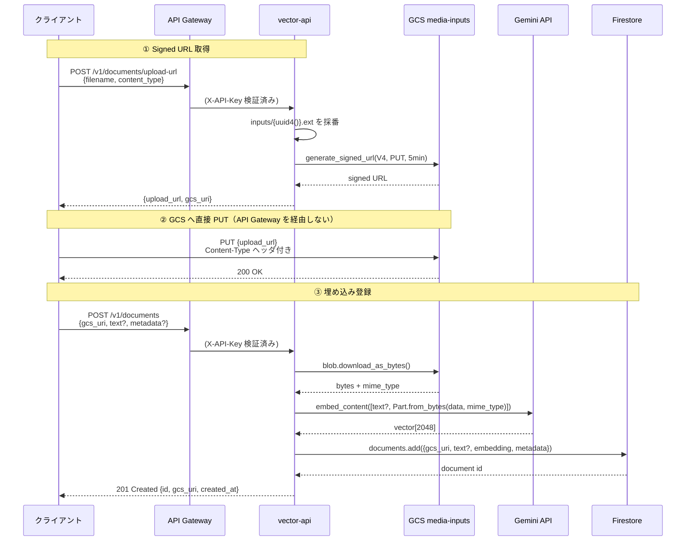
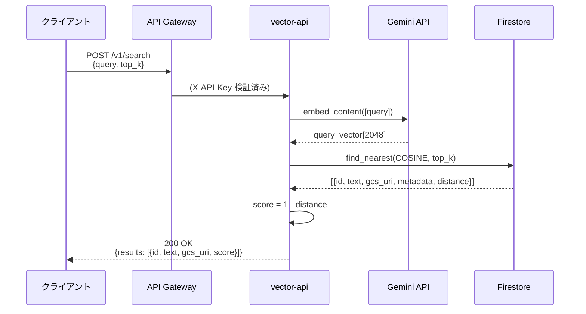

# システムアーキテクチャ

## 概要

テキスト・画像・PDF・動画・音声を統一ベクトル空間に格納し、自然言語クエリで横断検索できる個人向けサーバーレス・ベクトル検索システム。

---

## 全体構成図

---

## コンポーネント一覧

| コンポーネント           | 種別                 | 役割                                                                                |
| ------------------------ | -------------------- | ----------------------------------------------------------------------------------- |
| **Cloudflare Worker**    | Edge Proxy           | カスタムドメインから GCP API Gateway へ Host ヘッダを書き換えてプロキシ（ADR-0014） |
| **API Gateway**          | GCP Managed          | X-API-Key 認証。全エンドポイントの入口。Cloud Functions へルーティング（ADR-0003）  |
| **healthz**              | Cloud Functions Gen2 | `GET /health` 死活監視専用。128Mi / 10s タイムアウト                                |
| **vector-api**           | Cloud Functions Gen2 | ドキュメント登録・検索・メディアアップロード URL 発行。1Gi / 120s タイムアウト      |
| **Firestore**            | GCP Managed DB       | ドキュメントとベクトルを保存。2048-dim FLAT インデックス (COSINE 距離)（ADR-0001）  |
| **GCS media-inputs**     | GCP Storage          | メディアバイナリ一時保管。クライアントが Signed URL で直接 PUT する（ADR-0017）     |
| **Secret Manager**       | GCP Managed          | Gemini API Key を安全に注入（ADR-0006）                                             |
| **Gemini Embedding API** | Google AI (外部)     | `gemini-embedding-2` でテキスト・メディアを 2048-dim ベクトルに変換（ADR-0016）     |

---

## 主要フロー

### テキスト登録

### メディア登録（画像・PDF・動画・音声）

### ベクトル検索

---

## インフラ構成

| リソース               | 管理方法                                                    |
| ---------------------- | ----------------------------------------------------------- |
| GCP リソース全体       | Terraform (`terraform/gcp/`)                                |
| Cloudflare Worker      | Terraform (`terraform/cloudflare/`)                         |
| API Gateway 設定       | OpenAPI テンプレート (`api/openapi.yaml`)                   |
| Cloud Functions コード | Python 3.13 (`functions/vector-api/`, `functions/healthz/`) |
| Gemini API Key         | SOPS + KMS 暗号化 → Secret Manager（ADR-0006）              |

---

## セキュリティ設計

詳細は `docs/security.md` 参照。主要ポイント:

- **認証**: API Gateway 段で X-API-Key 検証（ADR-0003）。Cloud Functions は IAM で API GW からのみ受け付ける
- **最小権限**: 関数ごとに専用 Service Account。healthz は Firestore/Storage へのアクセス権なし
- **メディアバケット**: Public access prevention enforced / Uniform bucket-level access
- **Signed URL**: 5 分間のみ有効。Content-Type が署名時と一致しない場合 GCS が 403 を返す
- **スケール上限**: Cloud Functions max_instance_count = 3（ADR-0005 / D5）

---

## ADR 索引

| ADR                                                          | 内容                                                            |
| ------------------------------------------------------------ | --------------------------------------------------------------- |
| [0001](adr/0001-api-design-mvp.md)                           | API MVP 設計（エンドポイント・ID・スコア・エラー形式）          |
| [0003](adr/0003-authentication.md)                           | X-API-Key ヘッダ認証                                            |
| [0005](adr/0005-cloud-functions-runtime-stack.md)            | Cloud Functions Gen2 / Python / 関数分割粒度                    |
| [0006](adr/0006-secret-management-sops-kms.md)               | SOPS + KMS による Secret 管理                                   |
| [0014](adr/0014-cloudflare-worker-host-rewrite.md)           | Cloudflare Worker で Host ヘッダを書き換えて API Gateway へ接続 |
| [0016](adr/0016-embedding-dimension-2048-firestore-limit.md) | 埋め込み次元を 2048 に確定（Firestore 上限）                    |
| [0017](adr/0017-multimodal-media-upload-pattern.md)          | GCS Signed URL 直アップロード & Part.from_bytes                 |
