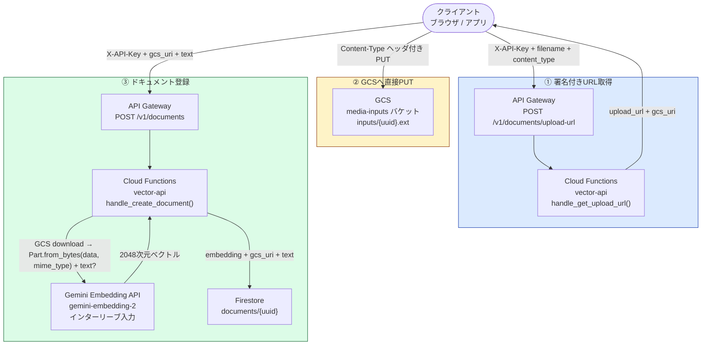
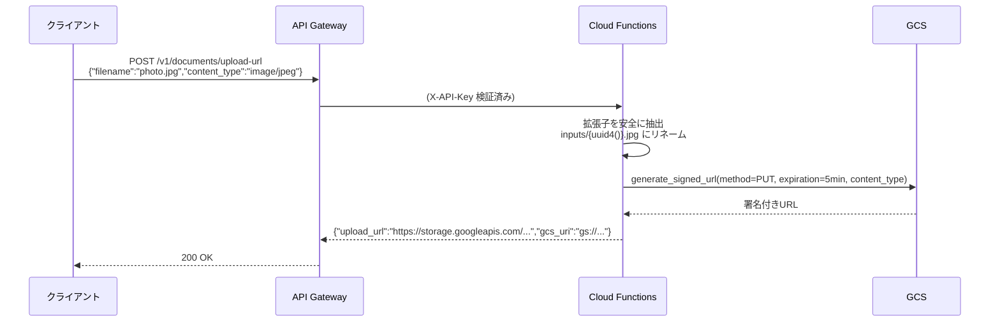
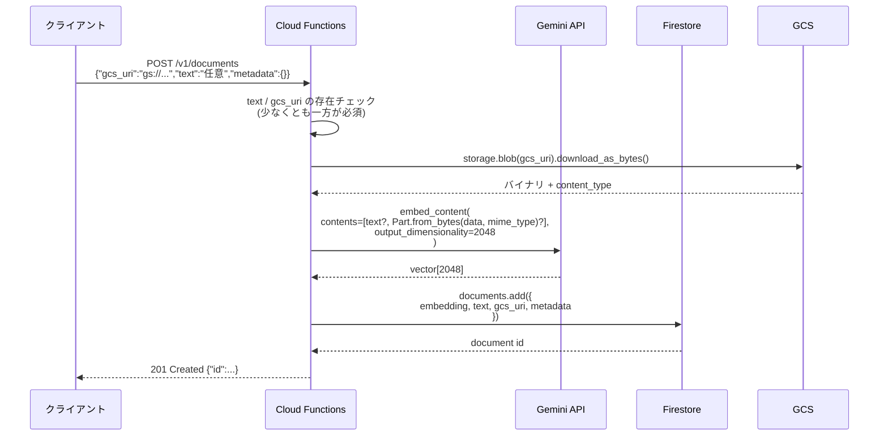
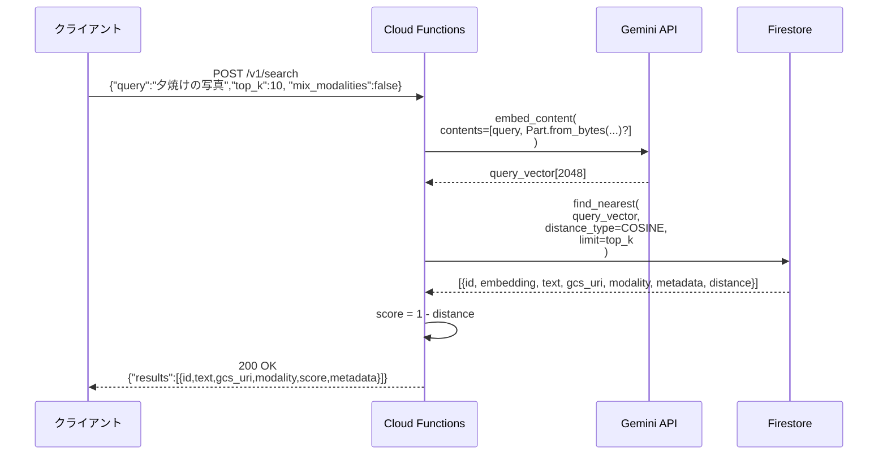
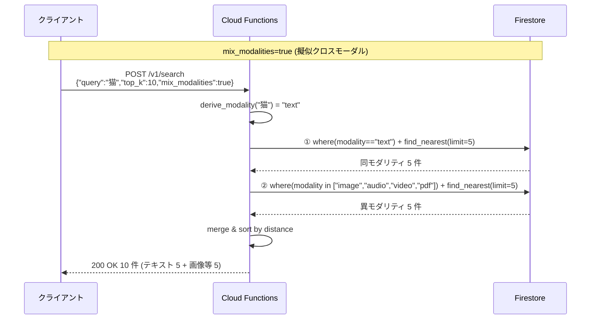
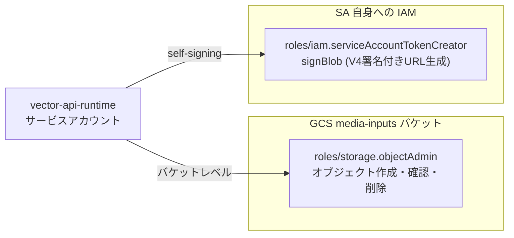

# マルチモーダル対応設計（メディア登録 / 検索）

テキスト専用だった MVP に対して、画像・音声などのメディアを登録・検索できるようにする拡張。
クライアントからバックエンドへのバイナリ直送を避け、GCS 署名付き URL 経由でブラウザから直接アップロードさせる設計を採用する。

---

## 全体アーキテクチャ



---

## メディア登録フロー（詳細）

### ① 署名付き URL 取得

クライアントはファイル名と MIME タイプを申告し、バックエンドが5分間だけ有効なGCS直アップ用URLを発行する。



**なぜ直アップを回避するか**

- Cloud Functions にバイナリを渡すと、関数の実行時間・メモリ・転送コストが跳ね上がる
- API Gateway には 32MB のリクエストボディ上限がある
- GCS 署名付き URL なら、バックエンドを経由せずにクライアントが直接 GCS へ PUT できるため、コスト・レイテンシ両方で有利

### ② クライアントから GCS へ直接 PUT

```
PUT {upload_url}
Content-Type: image/jpeg   ← 署名時に指定した MIME タイプと一致させる必要がある
Body: <バイナリ>
```

- 署名付き URL は5分間のみ有効（期限切れは 403）
- Content-Type が署名時と異なる場合も 403

### ③ ドキュメント登録

アップロード完了後、クライアントは `gcs_uri` を含めて `POST /v1/documents` を呼ぶ。
バックエンドは `text` と `gcs_uri` を混在させた**インターリーブ入力**で Gemini Embedding を呼び出す。



---

## マルチモーダル検索フロー

検索クエリはテキスト・メディア (`gcs_uri`) のいずれか or 両方を受け付ける。`gemini-embedding-2` がクエリと保存済みドキュメントを同一の 2048 次元ベクトル空間に射影し、Firestore の `find_nearest` で近傍探索する。



### マルチモーダル検索の実態と modality gap

技術仕様上、`gemini-embedding-2` はテキスト・画像・音声・動画・PDF をすべて **同一の 2048 次元ベクトル空間** に射影する。理論上はテキストクエリで画像が、画像クエリでテキストがヒットする（クロスモーダル検索）。

しかし [2026-06-23 の実測](measurements/2026-06-23-modality-gap.md) で、`gemini-embedding-2` の **modality gap**（同モダリティ内ペアと異モダリティ間ペアで cosine 距離が大きく異なる現象）が極端に大きいことが判明した。3 種類のテキストクエリで `top_k=50` を計測したところ、すべてのケースで 50 / 50 件が TXT、IMG が 1 件もヒットしない結果になっており、joint embedding と謳う公式仕様にもかかわらず実用上のクロスモーダル検索は弱い。

この modality gap を迂回するため、本システムは検索リクエストに `mix_modalities: true` を指定すると、Firestore の composite vector index + WHERE filter で **同モダリティで `top_k/2` + 異モダリティで `top_k/2`** を 2 回 `find_nearest` して結果を merge する擬似クロスモーダル経路を提供する。設計判断の経緯と trade-off は [ADR 0019](adr/0019-mix-modalities-filter-based-cross-modal.md) を参照。



> **実装メモ**: Google AI Studio (API Key 認証) は `Part.from_uri("gs://...")` を直接サポートしない。そのため Storage SDK でダウンロード後にインラインデータ (`Part.from_bytes(data, mime_type)`) として渡す。

---

## API インターフェース仕様

### 新設: POST /v1/documents/upload-url

| 項目       | 内容                          |
| ---------- | ----------------------------- |
| 認証       | `X-API-Key`（既存と同様）     |
| リクエスト | `UploadUrlRequest`            |
| レスポンス | `UploadUrlResponse`           |
| レート     | 既存の `/v1/documents` と同等 |

**リクエスト**

```json
{
  "filename": "photo.jpg",
  "content_type": "image/jpeg"
}
```

**レスポンス**

```json
{
  "upload_url": "https://storage.googleapis.com/project-media-inputs/inputs/550e8400...jpg?X-Goog-Signature=...",
  "gcs_uri": "gs://project-media-inputs/inputs/550e8400-e29b-41d4-a716-446655440000.jpg"
}
```

### 変更: POST /v1/documents

`text` を任意に変更し、`gcs_uri` フィールドを追加。

| フィールド | 型     | 必須 | 変更点                                               |
| ---------- | ------ | ---- | ---------------------------------------------------- |
| `text`     | string | 任意 | required → optional（min_length=1, max_length=8000） |
| `gcs_uri`  | string | 任意 | **新規追加**（pattern: `^gs://.+`）                  |
| `metadata` | object | 任意 | 変更なし                                             |

> バリデーション規則: `text` と `gcs_uri` のどちらか一方は必ず存在する。両方なし → 400 Validation Error。

**メディアのみ登録の例**

```json
{
  "gcs_uri": "gs://project-media-inputs/inputs/550e8400.jpg",
  "metadata": { "source": "camera", "tags": ["landscape"] }
}
```

**テキスト＋メディア混在登録の例**

```json
{
  "text": "夕焼けの海岸で撮影した写真",
  "gcs_uri": "gs://project-media-inputs/inputs/550e8400.jpg",
  "metadata": { "category": "nature" }
}
```

### 変更なし: POST /v1/search

クエリ仕様はテキストのまま。検索結果の `SearchResult` に `gcs_uri` を追加する。

```json
{
  "results": [
    {
      "id": "abc123",
      "text": "夕焼けの海岸で撮影した写真",
      "gcs_uri": "gs://project-media-inputs/inputs/550e8400.jpg",
      "score": 0.94,
      "metadata": { "category": "nature" }
    }
  ]
}
```

---

## データモデル（Firestore）

```
documents/{uuid}:
  text:             string | null        # テキストのみ / テキスト+メディア登録時に存在
  gcs_uri:          string | null        # メディア登録時に存在 (gs://bucket/inputs/uuid.ext)
  metadata:         object               # 自由形式（既存）
  embedding:        vector(2048)         # Gemini gemini-embedding-2 の出力
  embedding_model:  string                # 例: "gemini-embedding-2" (ADR 0004)
  modality:         string                # "text" / "image" / "audio" / "video" / "pdf" (ADR 0019)
  // createTime / updateTime は Firestore が自動付与
```

`modality` は登録時に `gcs_uri` の content_type から派生（gcs_uri がなければ "text"）。`mix_modalities` の filter 用 + UI 表示用に使う。詳細ルールは [ADR 0019](adr/0019-mix-modalities-filter-based-cross-modal.md) 参照。

**埋め込みのインターリーブ入力パターン**

| 登録パターン       | `embed_content` の `contents`                |
| ------------------ | -------------------------------------------- |
| テキストのみ       | `["テキスト文字列"]`                         |
| メディアのみ       | `[Part.from_bytes(data, mime_type)]`                   |
| テキスト＋メディア | `["テキスト文字列", Part.from_bytes(data, mime_type)]` |

---

## GCS バケット構成

| 項目           | 内容                                                            |
| -------------- | --------------------------------------------------------------- |
| バケット名     | `{project_id}-media-inputs`                                     |
| リージョン     | `asia-northeast1`（Cloud Functions と同一）                     |
| 用途           | メディアバイナリの一時保管                                      |
| アクセス制御   | Uniform bucket-level access / Public access prevention enforced |
| ライフサイクル | 作成から30日で自動削除（デモデータの課金抑止）                  |
| CORS           | `PUT`, `OPTIONS` を許可（ブラウザ直アップ対応）                 |

**ファイルパス設計**

```
inputs/{uuid4()}.{ext}
```

- クライアントが申告したファイル名は使わない（パストラバーサル / 衝突を排除）
- 拡張子のみ安全に抽出して引き継ぐ

---

## IAM 設計



| ロール                                 | 付与先                                          | 理由                                                                                                                                  |
| -------------------------------------- | ----------------------------------------------- | ------------------------------------------------------------------------------------------------------------------------------------- |
| `roles/storage.objectAdmin`            | `vector_api_runtime` SA → media-inputs バケット | 署名付きURL発行後のオブジェクト存在確認（`blob.exists()`）に読み取りが必要なため `objectCreator` では不足                             |
| `roles/iam.serviceAccountTokenCreator` | `vector_api_runtime` SA → 自分自身              | V4署名付きURLは内部で `iam.serviceAccounts.signBlob` を呼ぶ。Cloud Functions 環境では SA が自分自身に対してこのロールを持つ必要がある |

> **注意**: `signBlob` が呼べないと `generate_signed_url()` が `403 Forbidden` または `invalid_grant` で落ちる。デプロイ後に最初に必ず動作確認すること。

---

## バリデーション仕様

### UploadUrlRequest

| フィールド     | 型     | 制約                                |
| -------------- | ------ | ----------------------------------- |
| `filename`     | string | 必須 / 1文字以上                    |
| `content_type` | string | 必須 / 許可リストで検証（下記参照） |

**許可 MIME タイプ**（gemini-embedding-2 の対応フォーマットに基づく）

```python
ALLOWED_CONTENT_TYPES = {
    # 画像（最大6枚 / リクエスト）
    "image/jpeg",
    "image/png",
    "image/webp",
    "image/bmp",
    "image/heic",
    "image/heif",
    "image/avif",
    # PDF（最大1ファイル・最大6ページ / リクエスト、OCR搭載）
    "application/pdf",
    # 動画（最大1本 / リクエスト、音声付き80秒・無音120秒まで）
    "video/mp4",
    "video/mpeg",
    # 音声（最大1ファイル・最大180秒 / リクエスト）
    "audio/mp3",
    "audio/wav",
}
```

> 出典: [gemini-embedding-2 公式ドキュメント](https://docs.cloud.google.com/gemini-enterprise-agent-platform/models/gemini/embedding-2?hl=ja)

リスト外の MIME タイプは 400 Validation Error。`image/gif` は gemini-embedding-2 の非対応のため除外。

### DocumentCreateRequest（拡張後）

| 検証                              | 内容                                   |
| --------------------------------- | -------------------------------------- |
| `text` と `gcs_uri` 両方なし      | 400 `validation_error`                 |
| `text` が空文字列                 | 400 `validation_error`（min_length=1） |
| `gcs_uri` が `gs://` 始まりでない | 400 `validation_error`                 |
| `text` が 8000 文字超             | 400 `validation_error`                 |

---

## 制約・考慮事項

| 項目                    | 内容                                                                                                                                                                       |
| ----------------------- | -------------------------------------------------------------------------------------------------------------------------------------------------------------------------- |
| 署名付き URL の有効期限 | 5分。期限切れ後に PUT すると GCS が 403 を返す（バックエンドは検知しない）                                                                                                 |
| 入力トークン上限        | gemini-embedding-2 の最大入力は **8,192 トークン**。テキストは文字数で 8,000 を上限としてバリデーションする（既存の制約と同一）                                            |
| モダリティ上限          | 画像は 1リクエストあたり最大6枚、動画は最大1本（音声付き80秒・無音120秒）、音声は最大1ファイル180秒、PDF は最大1ファイル6ページ                                            |
| gcs_uri の所有確認      | 現実装では申告された `gcs_uri` が自バケット内かを検証しない。悪意ある URI を渡されると外部バケットの読み取りを試みる。本番化時にバケット名プレフィックスでフィルタすること |
| CORS origin             | 現在 `["*"]`。本番化の際は Firebase Hosting ドメイン等に絞ること                                                                                                           |
| ライフサイクル30日      | Firestore 側の `gcs_uri` フィールドは30日後にリンク切れになる。デモ用途前提の設計                                                                                          |
| Gemini インターリーブ   | テキストとメディアの順序は `embed_content` の仕様に従う。順序が検索精度に影響する可能性がある                                                                              |

---

## 関連リソース

| リソース               | 場所                                                                |
| ---------------------- | ------------------------------------------------------------------- |
| GCS バケット Terraform | [`terraform/gcp/media_bucket.tf`](../terraform/gcp/media_bucket.tf) |
| Cloud Functions 実装   | [`functions/vector-api/`](../functions/vector-api/)                 |
| OpenAPI 仕様           | [`api/openapi.yaml`](../api/openapi.yaml)                           |
| セキュリティ方針       | [`docs/security.md`](security.md)                                   |
| API MVP 設計           | [`docs/adr/0001-api-design-mvp.md`](adr/0001-api-design-mvp.md)     |
