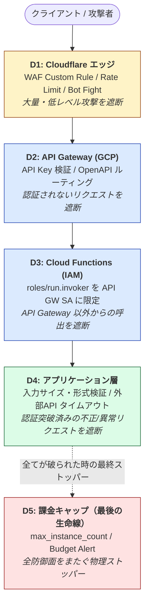

# セキュリティ & コスト保護方針（多層防御）

個人ラボとはいえ、DDoS や認証情報漏洩で GCP の課金が暴騰するシナリオは構造的に防ぎたい。本ドキュメントは「外から内へ」の順で多層防御（defense in depth）を整理する。

本ドキュメントの `D1`〜`D5` は defense の番号であり、OSI 参照モデルのレイヤー番号ではない。

## 全体像



---

## D1: Cloudflare エッジ

**目的**: GCP に到達する前に、明らかに不正な大量リクエストを遮断する。

| 対策 | 内容 | プラン |
|------|------|--------|
| Custom Rules | 特定IP/国/User-Agentの遮断 | 無料（5ルールまで） |
| Rate Limiting Rule | 例: `/v1/search` を 1分間30リクエスト/IP に制限 | 無料（1ルールまで） |
| Bot Fight Mode | 簡易ボット対策 | 無料 |
| DDoS Protection | ネットワーク/トランスポート層 DDoS は標準で常時有効 | 無料 |

### `/health` の保護方針

`/health` は API Gateway の API Key 認証を必須とする（ADR 0008）。API Key 不在 or 不一致のリクエストは Cloud Functions 起動前に API Gateway で弾く。

一方、API Key が漏洩した場合や正規の外形監視が高頻度で叩く場合は Cloud Functions の起動課金が発生し得るため、必要に応じて **Cloudflare 側でも吸収する**。

| 対策 | 内容 |
|------|------|
| Rate Limiting Rule | `/health` 専用に例 60 req/min/IP |
| Cache Rule         | `/health` レスポンスを Edge で 10〜30秒キャッシュし、origin リクエストを減らす |

無料 Rate Limiting Rule は1個しか使えないため、`/v1/search` 等の重いエンドポイントと `/health` のどちらに割り当てるかは Cloudflare 側 (`home-raspi-iac/terraform/cloudflare/`) の作業時に確定する。Cache Rule を使う場合は、API Key 必須の前提を壊さないように cache key / 対象クライアントを慎重に設計する。

**管理場所**: 本リポジトリでは管理しない。Cloudflare ゾーン (`riri-inferno.com`) は [home-raspi-iac](https://github.com/Riri-Inferno/home-raspi-iac) の `terraform/cloudflare/` で一元管理しているため、WAF/Rate Limit ルールもそちらに追加する。

**注**: 本格的なシグネチャベース WAF（Managed Rulesets）は Pro プラン（$20/月）以上。個人ラボでは Custom + Rate Limit で十分と判断。

## D2: API Gateway による認証

**目的**: 認証情報を持たないリクエストを、Cloud Functions が起動する **前** に弾く（起動課金を発生させない）。

- API Gateway の OpenAPI 仕様で **API Key 必須** を宣言（`securityDefinitions: api_key`）
- ヘッダー `X-API-Key` 不在 or 不一致 → API Gateway が 401/403 を返す
- → バックエンド Cloud Functions は **1ミリも起動しない**

将来的に JWT（Firebase Auth など）に切り替える場合も、API Gateway 層で完結させる。

> **設計判断**: 当初案にあった「Cloud Functions の Ingress 制限（internal-and-cloud-load-balancing）」は採用しない。理由は D3（IAM）と機能が重複し、かつ API Gateway → Cloud Functions の経路は GCLB を通らないため Ingress 設定での縛りと相性が悪い。D3 IAM で代替する。

## D3: IAM 最小権限（生 URL 直叩き対策 & 横展開抑止）

**目的**: API Gateway をバイパスして Cloud Functions の生 URL を叩かれても、コードを実行させない。万が一実行を許してしまっても、被害範囲を最小化する。

### 起動権限
- Cloud Functions は **認証必須** でデプロイ（`--no-allow-unauthenticated`）
- `roles/run.invoker` を **API Gateway 用のサービスアカウントだけ** に付与
- それ以外（GCP プロジェクト内の他 SA、外部ユーザー）は生 URL を叩いても 401

### Cloud Functions のランタイム権限
Cloud Functions 自身が動くときの SA には、必要最小限のロールだけ付与：

| 必要なロール | 用途 |
|---|---|
| `roles/datastore.user` | Firestore ベクトル/メタデータの読み書き |
| `roles/secretmanager.secretAccessor` | Google AI Studio の API Key 取得 |
| `roles/storage.objectViewer`（将来） | Cloud Storage 画像アセットの読み取り |

Google AI Studio API は **API Key 認証**なので IAM ロールは不要（Secret Manager から取得して呼ぶだけ）。将来 Vertex AI に切り替える際は `roles/aiplatform.user` を追加する。

## D4: アプリケーション層バリデーション

**目的**: 認証を突破した「正規のリクエスト」のうち、異常な内容を弾く。盗まれた API Key で叩かれるケースを含む。

- **リクエストサイズ制限**: テキストは最大文字数、画像は最大バイト数で上限。バリデーションフレームワーク（Pydantic 等）でリクエスト時点で拒否
- **外部 API 呼出のタイムアウト**: Google AI Studio API 呼出に明示的タイムアウト（例: 10秒）。詰まりっぱなしによる起動課金延長を防ぐ
- **入力フォーマット検証**: 想定外のフィールド、巨大配列、再帰的構造などを拒否

> ランタイムフレームワークは未確定（functions-framework 単独 / FastAPI ラップ等）のため、ここでは「入力検証層を必ず置く」というルールだけ規定する。

## D5: 課金キャップ（最後の生命線）

**目的**: D1〜D4 が全部抜けたシナリオでも、致命的な金額の課金を構造的に発生させない。

### ★最重要: `max_instance_count` による物理キャップ
Cloud Functions (2nd gen) の Terraform 定義で `max_instance_count` を小さく縛る（例: 3〜5）。これで **何が起きても同時起動数が物理的に上限に張り付く** ため、課金は単価 × 上限 × 実行時間で頭打ちになる。

これは「通知」ではなく「物理キャップ」なので最も信頼できる。

### Budget Alert（通知のみ）

> ⚠️ **重要な誤解ポイント**: GCP の Budget Alert は **通知だけで課金は止まらない**。メールが届くだけで、リソースは動き続ける。

本気で「自動停止」させたい場合は以下の追加実装が必要：

```
Budget Alert → Pub/Sub → Cloud Functions → Cloud Billing API でプロジェクトの請求リンクを切断
```

これは "kill switch" と呼ばれるパターン。本ラボでは **当面は `max_instance_count` の物理キャップで十分** と判断し、kill switch は実装しない。Budget Alert は **異常検知用の通知** として置く（例: 月 ¥500 / ¥1,000 / ¥3,000 の3段階）。

---

## 採用しない対策（理由付き）

| 対策 | 理由 |
|------|------|
| Cloud Functions の Ingress 制限 | D3 IAM と機能重複。かつ API Gateway 経由が GCLB を通らないため設計と噛み合わない |
| Cloudflare Managed Rules (WAF) | 月額 $20。個人ラボでは Custom + Rate Limit で十分 |
| 課金 kill switch (Pub/Sub → Billing API) | `max_instance_count` の物理キャップで代替。将来検討 |

## 関連リソースの管理場所

- **Cloudflare（D1）**: [home-raspi-iac](https://github.com/Riri-Inferno/home-raspi-iac) `terraform/cloudflare/`
- **GCP（D2〜D5）**: 本リポジトリ `terraform/gcp/`
