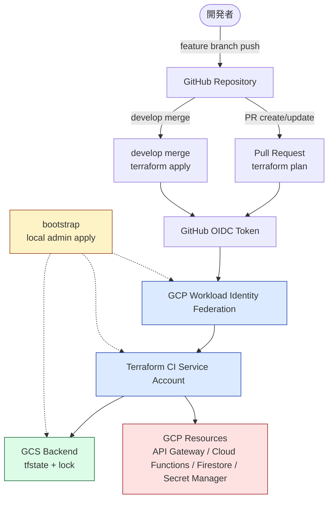

# Terraform GitOps & Bootstrap 方針

本リポジトリでは、GCP リソースを Terraform で管理し、通常運用は GitHub Actions から `plan` / `apply` する。初回構築だけは GitHub Actions 自身が GCP に入るための土台が存在しないため、ローカル管理者権限で bootstrap を実行する。

対象 GCP プロジェクトは `riri-vector-lab-2026`。Cloudflare 側の DNS / WAF / Rate Limit は本リポジトリでは管理せず、`home-raspi-iac` の `terraform/cloudflare/` に集約する。

## 全体像



---

## Phase 0: Bootstrap（初回だけローカル apply）

**目的**: GitHub Actions が Terraform を実行できるようにするための最低限の土台を作る。

GitHub Actions は GCP の Workload Identity Federation (WIF) を使って認証する。しかし、その WIF / CI 用サービスアカウント / tfstate bucket 自体は、Actions が動く前に存在している必要がある。したがって初回だけ `terraform/bootstrap/` をローカル管理者権限で apply する。

`terraform/bootstrap/` で管理するもの：

| リソース                     | 用途                                                                 |
| ---------------------------- | -------------------------------------------------------------------- |
| GCS bucket                   | Terraform remote state の保存先                                      |
| Workload Identity Pool       | GitHub OIDC を受ける信頼境界                                         |
| Workload Identity Provider   | `Riri-Inferno/gcp-serverless-vector-search` からの OIDC token を検証 |
| Terraform CI Service Account | GitHub Actions が impersonate する実行主体                           |
| IAM binding                  | GitHub OIDC principal に CI SA の impersonation を許可               |
| Project IAM                  | CI SA が Terraform apply できる権限                                  |

bootstrap の state は最初だけ local state でよい。GCS backend bucket 作成後、必要であれば bootstrap 自身の state も GCS backend へ移行する。

## Phase 1: Terraform GCP（通常のアプリリソース）

**目的**: アプリ本体に必要な GCP リソースを GitOps で管理する。

`terraform/gcp/` は GCS backend を使い、通常は GitHub Actions からのみ apply する。ローカル apply は緊急時や bootstrap 調整時の例外とする。

`terraform/gcp/` で管理する予定のもの：

| リソース                | 用途                                               |
| ----------------------- | -------------------------------------------------- |
| Project services        | 必要な Google API の有効化                         |
| Service Accounts        | Cloud Functions / API Gateway / Terraform 実行主体 |
| IAM                     | 最小権限、または初期構築時の強めの権限             |
| Secret Manager          | Google AI Studio API Key など                      |
| Firestore               | ベクトル + メタデータ保存                          |
| Cloud Functions 2nd gen | Python API 実装                                    |
| API Gateway             | OpenAPI ルーティング、API Key 認証                 |
| Cloud Storage           | 画像アセット保存（将来）                           |
| Budget Alert            | 通知用。課金停止ではない                           |

## Phase 2: GitHub Actions

**目的**: Pull Request で plan、`develop` merge で apply する。

`home-raspi-iac` の運用に合わせ、PR では差分確認だけを行い、`develop` へ merge された変更だけを本番反映する。

feature branch への push 単体では plan しない。PR 作成後は、PR branch への追加 push により `pull_request` の `synchronize` が発火し、PR 上の最新差分に対して plan する。

| Workflow                  | Trigger                 | 実行内容                                                   |
| ------------------------- | ----------------------- | ---------------------------------------------------------- |
| `terraform-gcp-plan.yml`  | Pull Request / manual   | `terraform init` → `terraform validate` → `terraform plan` |
| `terraform-gcp-apply.yml` | `develop` push / manual | `terraform init` → `terraform apply -auto-approve`         |

workflow には `permissions.id-token: write` を付与する。これにより GitHub Actions が OIDC token を発行でき、GCP WIF 経由で CI SA を impersonate できる。

PR plan は fork ではなく同一 repository の PR を主対象とする。外部 fork からの PR で plan を動かす必要が出た場合は、OIDC / secrets / 権限境界を別途見直す。

apply workflow には **`concurrency` group を必ず設定する**。`develop` への連続 push で apply が並行起動すると、tfstate のロック競合や差分の取り違えが起きる。グループ名を固定して `cancel-in-progress: false` でシリアル化する：

```yaml
concurrency:
  group: terraform-gcp-apply
  cancel-in-progress: false
```

plan workflow は PR 単位で並列実行されてよいので、設定するなら `group: terraform-gcp-plan-${{ github.ref }}` のように PR ごとに分ける。

## 設計項目: WIF / OIDC 信頼境界

**目的**: 長期鍵を GitHub Secrets に置かず、短命 token で Terraform を実行する。

採用する認証経路：

```
GitHub Actions OIDC token
  → GCP Workload Identity Provider
  → Terraform CI Service Account impersonation
  → Terraform plan/apply
```

WIF Provider は repository を pin する：

```hcl
attribute_condition = "assertion.repository == 'Riri-Inferno/gcp-serverless-vector-search'"
```

branch まで WIF 側で縛ると PR plan が扱いづらくなるため、最初は repository 単位で pin する。apply は GitHub Actions 側の trigger を `develop` に限定する。

より厳格にする場合は、将来的に以下のように分ける：

| 対象  | 制限方法                                                                               |
| ----- | -------------------------------------------------------------------------------------- |
| plan  | repository pin                                                                         |
| apply | repository pin + `assertion.ref == 'refs/heads/develop'` または environment protection |

## 設計項目: IAM 方針

**目的**: 初期構築の出戻りを減らしつつ、あとから権限を絞れる形で IaC 化する。

初期フェーズでは CI SA に強めの権限を付与してよい。API Gateway / Cloud Functions Gen2 / Cloud Run / Secret Manager / Firestore / Service Usage / IAM などは、Terraform apply 時に resource-level IAM や service enablement で詰まりやすいため、最初から過度に細かく分解しない。

初期候補：

| ロール                                 | 理由                                                                             |
| -------------------------------------- | -------------------------------------------------------------------------------- |
| `roles/owner`                          | 初期構築での権限不足を避ける。IAM / API enablement / resource 作成まで一通り通す |
| `roles/serviceusage.serviceUsageAdmin` | Google API 有効化                                                                |
| `roles/iam.serviceAccountTokenCreator` | 必要になった場合の SA impersonation 補助                                         |

`roles/owner` を採用する場合でも、WIF Provider の repository pin と CI SA impersonation binding を境界として扱う。運用が安定したら、実際に必要だった権限を見ながら `roles/editor` + 個別 admin role、またはさらに細かい custom role へ縮小する。

Billing Budget を Terraform 管理する場合は、billing account 側 IAM が別途必要になる。billing account IAM は project IAM とは別物なので、初回だけ手動付与が必要になる可能性が高い。

## 設計項目: tfstate / backend

**目的**: Terraform state を GCS に置き、Actions とローカルの状態を共有する。

GCS backend bucket は backend 初期化前に存在している必要がある。そのため bucket は `terraform/bootstrap/` で作成する。

backend prefix は用途別に分ける：

| Terraform root         | Backend prefix |
| ---------------------- | -------------- |
| `terraform/bootstrap/` | `bootstrap`    |
| `terraform/gcp/`       | `gcp`          |

state bucket には以下を設定する：

- Uniform bucket-level access
- Public access prevention
- Versioning
- `force_destroy = false`

tfstate には secret value を含む可能性があるため、bucket IAM は Terraform CI SA と管理者に限定する。

### Lock 方式

Terraform 1.10 以降、GCS backend は **オブジェクトベースの native lock** をサポートする。`backend "gcs"` ブロックに `use_lockfile = true` を指定するだけで lock ファイルが state と同じ bucket 上に作られ、別途 Firestore / Spanner などの外部 lock サービスは不要：

```hcl
terraform {
  backend "gcs" {
    bucket       = "riri-vector-lab-2026-tfstate"  # 仮称、bootstrap で決定
    prefix       = "gcp"
    use_lockfile = true
  }
}
```

state bucket と同じ場所にロック情報が置かれるので、`force_destroy = false` の保護対象に含まれる。

---

## 初回構築フロー

1. `riri-vector-lab-2026` に対してローカル管理者認証を行う（`gcloud auth login` + `gcloud config set project riri-vector-lab-2026`）
2. **bootstrap apply の前提となる API を手動で有効化する**：
   ```bash
   gcloud services enable \
     iamcredentials.googleapis.com \
     cloudresourcemanager.googleapis.com \
     serviceusage.googleapis.com \
     iam.googleapis.com
   ```
   これらが無効だと WIF Provider 作成や CI SA の impersonation 設定で apply が転ける。bootstrap 自身が `google_project_service` で同じ API を有効化する形にしても、**初回 apply 時の依存関係を解くために事前有効化が必要**
3. `terraform/bootstrap/` を local backend で `terraform init`
4. `terraform/bootstrap/` を `terraform apply`
5. 作成された WIF Provider 名と CI SA email を GitHub Actions workflow に設定
6. `terraform/gcp/` の GCS backend を `terraform init`（`use_lockfile = true` を指定）
7. PR で `terraform-gcp-plan.yml` が通ることを確認
8. `develop` merge で `terraform-gcp-apply.yml` が通ることを確認
9. 必要なら bootstrap state を GCS backend へ移行

## 採用しない対策（初期フェーズ）

| 対策                                    | 理由                                                                                |
| --------------------------------------- | ----------------------------------------------------------------------------------- |
| Service Account Key JSON                | 長期鍵を GitHub Secrets に置きたくない。WIF/OIDC で代替する                         |
| 最初から完全な最小権限 custom role      | Cloud Functions Gen2 / API Gateway / IAM 周りで出戻りが増える。初期構築後に縮小する |
| Cloudflare リソースを本リポジトリで管理 | `home-raspi-iac` 側で zone 全体を一元管理する方針と衝突する                         |
| fork PR からの Terraform plan 実行      | OIDC / 権限境界が複雑になる。必要になってから設計する                               |

## 未確定事項

| 項目                | 現状                                                |
| ------------------- | --------------------------------------------------- |
| GCP project number  | `riri-vector-lab-2026` から取得して確定する         |
| tfstate bucket name | project 内で一意な名前を決める                      |
| Billing Budget      | Terraform 管理するか、初期は手動/後回しにするか未定 |
| CI SA の最終権限    | 初期は強め。安定後に縮小                            |

## 関連リソースの管理場所

- **Bootstrap / WIF / tfstate bucket**: 本リポジトリ `terraform/bootstrap/`
- **GCP アプリリソース**: 本リポジトリ `terraform/gcp/`
- **GitHub Actions**: 本リポジトリ `.github/workflows/`
- **Cloudflare DNS / WAF / Rate Limit**: `home-raspi-iac` `terraform/cloudflare/`
